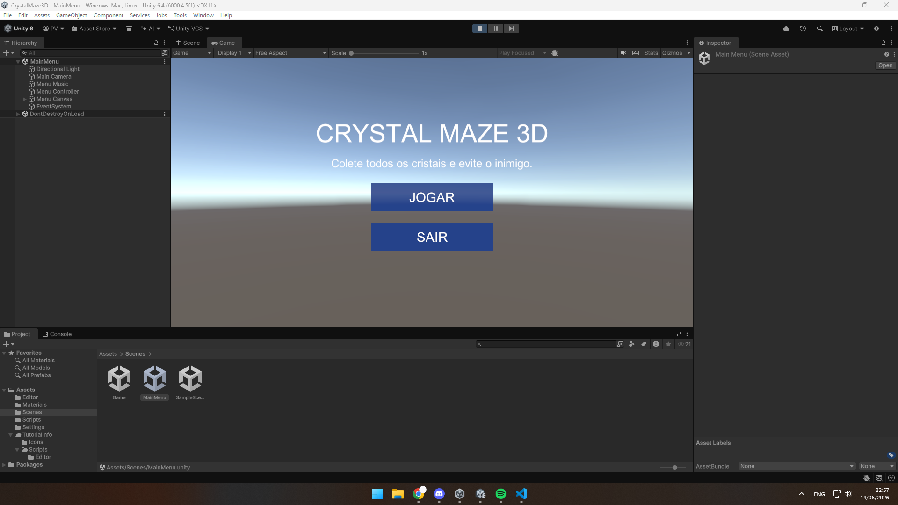
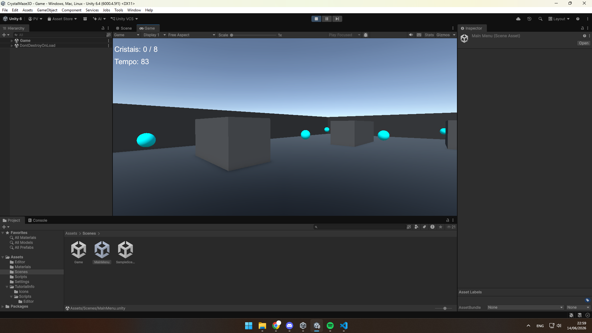
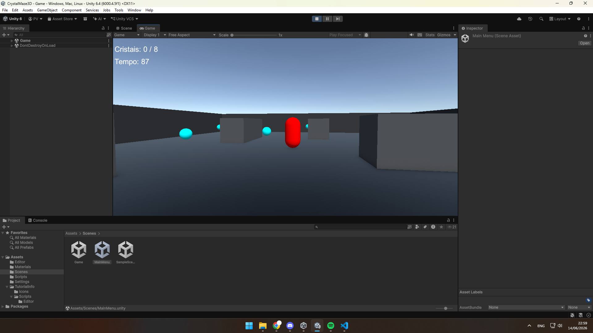

# Crystal Maze 3D

**Desenvolvedor:** Pedro Conrado Fernandes Vieira  
**Engine:** Unity 3D  
**Plataforma:** PC  

## Descrição do jogo

**Crystal Maze 3D** é um jogo 3D em primeira pessoa desenvolvido na Unity.  
O jogador deve explorar uma arena, coletar todos os cristais espalhados pelo cenário e evitar ser capturado por um inimigo que patrulha o mapa.

O jogo possui menu inicial com música de fundo, movimentação por teclado, controle de câmera pelo mouse, sistema de coleta, contador de cristais, temporizador, inimigo patrulhando e condição de vitória/derrota.

## Instruções de jogabilidade

- **W, A, S, D:** movimentar o personagem
- **Mouse:** controlar a câmera
- **Esc:** voltar ao menu
- **Objetivo:** coletar todos os cristais antes que o tempo acabe
- **Cuidado:** se o inimigo encostar no jogador, o jogo termina

## Vídeo de gameplay

Assista ao vídeo de gameplay no YouTube:

https://youtu.be/85Rhg3LHHRA

## Prints do jogo

### Menu principal



### Gameplay - coleta de cristais



### Gameplay - inimigo patrulhando



---

# Funcionalidades desenvolvidas

## 1. Menu principal com música de fundo

Foi desenvolvido um menu principal com botões para iniciar o jogo e sair da aplicação.  
Além disso, o menu possui música de fundo gerada por script, usando um `AudioSource` e um `AudioClip` criado em tempo de execução. Isso permite que o jogo tenha áudio mesmo sem importar arquivos externos.

Trecho do código usado na funcionalidade:

```csharp
using UnityEngine;

[RequireComponent(typeof(AudioSource))]
public class MenuMusic : MonoBehaviour
{
    public float volume = 0.18f;

    void Start()
    {
        AudioSource source = GetComponent<AudioSource>();
        source.clip = CreateMusicClip();
        source.loop = true;
        source.volume = volume;
        source.Play();
    }

    AudioClip CreateMusicClip()
    {
        int sampleRate = 44100;
        int durationSeconds = 8;
        int samples = sampleRate * durationSeconds;

        AudioClip clip = AudioClip.Create("MenuMusicGenerated", samples, 1, sampleRate, false);
        float[] data = new float[samples];

        float[] notes = { 261.63f, 329.63f, 392.00f, 523.25f };

        for (int i = 0; i < samples; i++)
        {
            float time = (float)i / sampleRate;
            int noteIndex = Mathf.FloorToInt(time * 2f) % notes.Length;
            float frequency = notes[noteIndex];

            data[i] = Mathf.Sin(2f * Mathf.PI * frequency * time) * volume;
        }

        clip.SetData(data, 0);
        return clip;
    }
}
```

### Print da funcionalidade


---

## 2. Movimentação do jogador e câmera pelo mouse

Foi desenvolvido um sistema de movimentação em primeira pessoa.  
O jogador utiliza o teclado para andar pelo cenário e o mouse para controlar a direção da câmera. Também foi implementado pulo e gravidade usando `CharacterController`.

Trecho do código usado na funcionalidade:

```csharp
using UnityEngine;

[RequireComponent(typeof(CharacterController))]
public class PlayerController : MonoBehaviour
{
    public float moveSpeed = 6f;
    public float jumpForce = 2.5f;
    public float gravity = -9.81f;
    public float mouseSensitivity = 120f;
    public Transform playerCamera;

    private CharacterController controller;
    private Vector3 verticalVelocity;
    private float cameraVerticalRotation;

    void Start()
    {
        controller = GetComponent<CharacterController>();
        Cursor.lockState = CursorLockMode.Locked;
        Cursor.visible = false;
    }

    void Update()
    {
        MovePlayer();
        RotateCamera();
    }

    void MovePlayer()
    {
        float x = Input.GetAxis("Horizontal");
        float z = Input.GetAxis("Vertical");

        Vector3 movement = transform.right * x + transform.forward * z;
        controller.Move(movement * moveSpeed * Time.deltaTime);

        if (controller.isGrounded && verticalVelocity.y < 0)
        {
            verticalVelocity.y = -2f;
        }

        if (Input.GetButtonDown("Jump") && controller.isGrounded)
        {
            verticalVelocity.y = Mathf.Sqrt(jumpForce * -2f * gravity);
        }

        verticalVelocity.y += gravity * Time.deltaTime;
        controller.Move(verticalVelocity * Time.deltaTime);
    }

    void RotateCamera()
    {
        float mouseX = Input.GetAxis("Mouse X") * mouseSensitivity * Time.deltaTime;
        float mouseY = Input.GetAxis("Mouse Y") * mouseSensitivity * Time.deltaTime;

        cameraVerticalRotation -= mouseY;
        cameraVerticalRotation = Mathf.Clamp(cameraVerticalRotation, -85f, 85f);

        playerCamera.localRotation = Quaternion.Euler(cameraVerticalRotation, 0f, 0f);
        transform.Rotate(Vector3.up * mouseX);
    }
}
```

### Print da funcionalidade


---

## 3. Sistema de coleta de cristais

Foi desenvolvido um sistema de coleta em que o jogador deve encostar nos cristais espalhados pelo mapa.  
Quando um cristal é coletado, ele é removido da cena e o contador da interface é atualizado. Quando todos os cristais são coletados, o jogador vence a partida.

Trecho do código usado na funcionalidade:

```csharp
using UnityEngine;

public class CrystalCollectible : MonoBehaviour
{
    public float rotationSpeed = 80f;

    void Update()
    {
        transform.Rotate(Vector3.up * rotationSpeed * Time.deltaTime, Space.World);
    }

    void OnTriggerEnter(Collider other)
    {
        if (!other.CompareTag("Player"))
        {
            return;
        }

        if (GameManager.Instance != null)
        {
            GameManager.Instance.CollectCrystal();
        }

        Destroy(gameObject);
    }
}
```

### Print da funcionalidade


---

## 4. Inimigo patrulhando o cenário

Também foi implementado um inimigo simples que patrulha entre dois pontos do mapa.  
Se o jogador se aproximar demais do inimigo, a partida termina em derrota.

Trecho do código usado na funcionalidade:

```csharp
using UnityEngine;

public class EnemyPatrol : MonoBehaviour
{
    public Transform pointA;
    public Transform pointB;
    public Transform player;
    public float speed = 3f;
    public float catchDistance = 1.6f;

    private Transform target;

    void Start()
    {
        target = pointB;

        if (player == null)
        {
            GameObject playerObject = GameObject.FindGameObjectWithTag("Player");
            if (playerObject != null)
            {
                player = playerObject.transform;
            }
        }
    }

    void Update()
    {
        Patrol();
        CheckPlayerDistance();
    }

    void Patrol()
    {
        if (pointA == null || pointB == null)
        {
            return;
        }

        transform.position = Vector3.MoveTowards(
            transform.position,
            target.position,
            speed * Time.deltaTime
        );

        if (Vector3.Distance(transform.position, target.position) < 0.2f)
        {
            target = target == pointA ? pointB : pointA;
        }
    }

    void CheckPlayerDistance()
    {
        if (player == null)
        {
            return;
        }

        if (Vector3.Distance(transform.position, player.position) <= catchDistance)
        {
            if (GameManager.Instance != null)
            {
                GameManager.Instance.GameOver("Você foi capturado pelo inimigo!");
            }
        }
    }
}
```

### Print da funcionalidade


---
